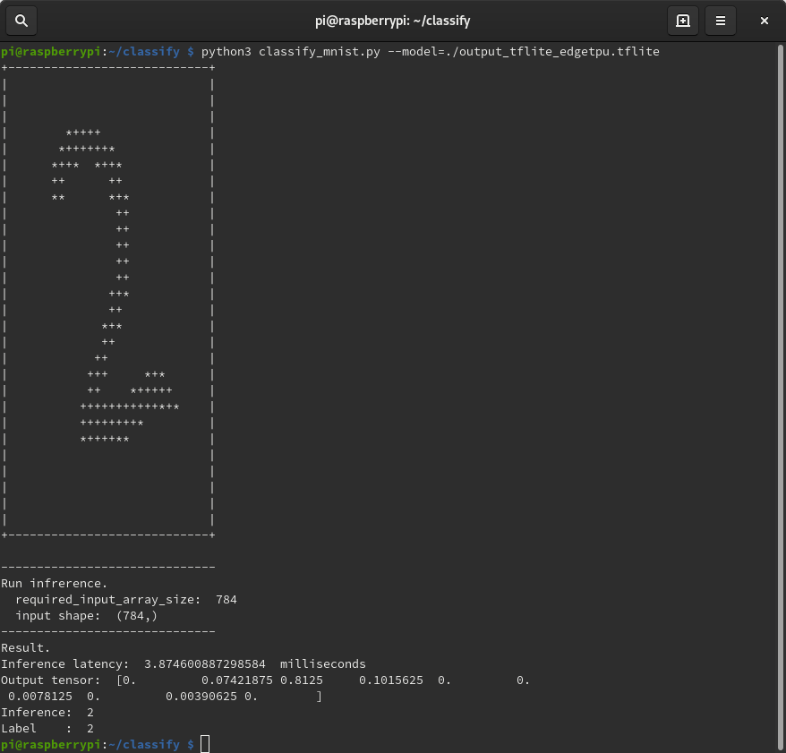

# Create Own Edge TPU Model.

## About
The Edge TPU has a great sample.
However, the samples are only image classification(slim) and object detection(object detection api), and there is no way to build and learn your own model.<br>
This is a sample for converting your own model from learning to Edge TPU Model.<br>
The model uses TensorFlow's MNIST Network sample (fully_connected_feed).<br>

## Environment
- Coral USB Accelerator(May be Devboard)

## Installation
- Tensorflow (Learning only)
- Edge TPU Python library [(Get started with the USB Accelerator)](https://coral.withgoogle.com/tutorials/accelerator/)

## How to Train

### 1.Create Model and Quantization-aware training
It is a sample of Jupyter notebook.<br>
This sample is based on the Tensorflow tutorial [(MNIST fully_connected_feed.py)](https://github.com/tensorflow/tensorflow/blob/master/tensorflow/examples/tutorials/mnist/fully_connected_feed.py).<br>
Open train/MNIST_fully_connected_feed.ipynb and Run All.<br>
When learning is complete, a model is generated in the following directory:
```
  train
    + logs
    |    + GraphDef
    + checkpoint
    + model.ckpt-xxxx.data-00000-of-00001
    + model.ckpt-xxxx.index
    + model.ckpt-xxxx.meta 
    + minist_fully_connected_feed_graph.pb
```

model.ckpt is a ckecpoint file.<br>
The number of learning steps is recorded in "xxxx".<br>
The default is 4999 maximum.
minist_fully_connected_feed_graph.pb is a GrarhDef file.

The GraphDef directory contains the structure of the model.<br>
You can check with tensorboard.<br>
(Move dir and ```tensorboard --logdir=./```)

"Quantization-aware training" is required to generate Edge TPU Model.<br>
See [Quantization-aware training](https://github.com/tensorflow/tensorflow/tree/master/tensorflow/contrib/quantize) for details.

### 2.Freeze Graph
Converts checkpoint variables into Const ops in a standalone GraphDef file.<br>
Use the freeze_graph command.<br>
The freeze_minist_fully_connected_feed_graph.pb file is generated in the logs directory.<br>
```
$ freeze_graph \
  --input_graph=./logs/minist_fully_connected_feed_graph.pb \
  --input_checkpoint=./logs/model.ckpt-4999 \
  --input_binary=true \
  --output_graph=./logs/freeze_minist_fully_connected_feed_graph.pb \
  --output_node_names=softmax_tensor
```
  
### 3.Convert TF-Lite Model
Generate a TF-Lite model using the tflite_convert command.<br>
The output_tflite_graph.tflite file is generated in the logs directory.<br>
```
$ tflite_convert \
  --output_file=./logs/output_tflite_graph.tflite \
  --graph_def_file=./logs/freeze_minist_fully_connected_feed_graph.pb \
  --inference_type=QUANTIZED_UINT8 \
  --input_arrays=input_tensor \
  --output_arrays=softmax_tensor \
  --mean_values=0 \
  --std_dev_values=255 \
  --input_shapes="1,784"
```

### 4.Compile Edge TPU Model
Compile the TensorFlow Lite model for compatibility with the Edge TPU.<br>
See [Edge TPU online compiler](https://coral.withgoogle.com/web-compiler) for details.

# How to Run a model on the Edge TPU
First, Copy the Edge TPU Model to the classify directory.<br>
The directory structure is as follows.<br>
```
  classify
    + classify_mnist.py
    + mnist_data.py
    + xxxx_edgetpu.tflite
```
Note: "xxxx_edgetpu.tflite" is Edge TPU Model. This repository contains "mnist_tflite_edgetpu.tflite"

Then, classify MNIST data:
```
$ python3 classify_mnist.py --model=./mnist_tflite_edgetpu.tflite
```

The result of classification with images is displayed on the console as follows.<br>
"Inference latency:" and "Output tensor:" are return values of the RunInference method of eddypu.basic.basic_engine.BasicEngine.<br>
(See details [Python API](https://coral.withgoogle.com/docs/reference/edgetpu.basic.basic_engine/#edgetpu.basic.basic_engine.BasicEngine.RunInference))<br>
"Inference" is the most accurate value of "output tensor" (correct and predicted numbers).<br>
"Label" is the correct label.<br>


Note: Full command-line options:
```
$ python3 classify_mnist.py -h
```

## How to Run a model on the TF-Lite 
If you want to use the TF-Lite API, take a look at the notebook sample.
Classify MNIST using TF-Lite Model.


For more information, please refer [my blogs](https://nextremer-nbo.blogspot.com/).<br>
(comming soon. but sorry japanese only.)